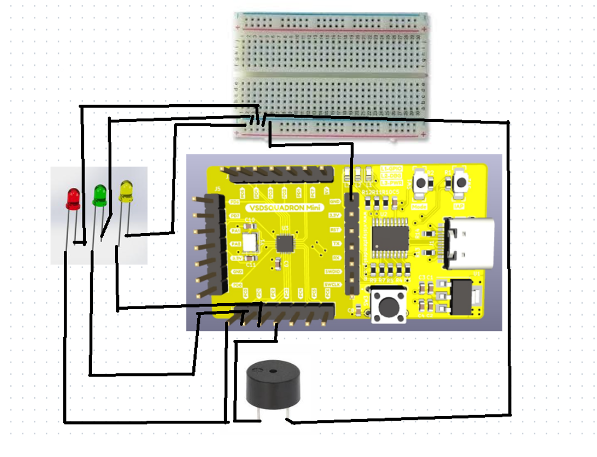

# samsung_risc_v
**Samsung RISC-V Internship** – A hands-on exploration of **RISC-V architecture, toolchains, embedded systems, and industry applications**, featuring projects, research, and optimizations for real-world use cases. 

  
TASK1:Development of C Based LAB

  
  
  
   
   
   

  
TASK2:Simulation with Spike

  
   
   
   

  
TASK3:Identification of RISCV instructions

  

# RISC-V Assembly Instructions Breakdown

## 1. auipc a5, 0xfffff
- **Instruction Type:** U-type
- **Opcode:** 0010111 (AUIPC)
- **rd:** a5 (x15) = 01111
- **imm[31:12]:** 0xfffff = 11111111111111111111
- **Binary Encoding:** 11111111111111111111 01111 0010111
- **Hex Representation:** `0xfff00797`

---

## 2. addi a5, a5, -216
- **Instruction Type:** I-type
- **Opcode:** 0010011 (ADDI)
- **funct3:** 000
- **rs1:** a5 (x15) = 01111
- **rd:** a5 (x15) = 01111
- **imm[11:0]:** -216 = 0xFF28 = 1111111100101000
- **Binary Encoding:** 111111110010 01111 000 01111 0010011
- **Hex Representation:** `0x25878793`

---

## 3. beqz a5, 100c8
- **Instruction Type:** B-type
- **Opcode:** 1100011 (BEQ)
- **funct3:** 000
- **rs1:** a5 (x15) = 01111
- **rs2:** x0 = 00000
- **imm[12|10:5|4:1|11]:** 000000000100
- **Binary Encoding:** 0000000 01111 00000 000 0010 1100011
- **Hex Representation:** `0x00078063`

---

## 4. ret (Equivalent to jalr x0, ra, 0)
- **Instruction Type:** I-type
- **Opcode:** 1100111 (JALR)
- **funct3:** 000
- **rs1:** ra (x1) = 00001
- **rd:** x0 = 00000
- **imm[11:0]:** 000000000000
- **Binary Encoding:** 000000000000 00001 000 00000 1100111
- **Hex Representation:** `0x00008067`

---

## 5. auipc gp, 0x1
- **Instruction Type:** U-type
- **Binary Encoding:** 00000000000000000001 00110 0010111
- **Hex Representation:** `0x00010197`

---

## 6. addi gp, gp, -1208
- **Instruction Type:** I-type
- **Binary Encoding:** 111011001000 00110 000 00110 0010011
- **Hex Representation:** `0xb4181913`

---

## 7. addi a0, gp, 1898
- **Instruction Type:** I-type
- **Binary Encoding:** 011101011010 00110 000 01000 0010011
- **Hex Representation:** `0x76418513`

---

## 8. auipc a2, 0x1
- **Instruction Type:** U-type
- **Binary Encoding:** 00000000000000000001 00110 0010111
- **Hex Representation:** `0x00001617`

---

## 9. addi a2, a2, 968
- **Instruction Type:** I-type
- **Binary Encoding:** 000011110000 00110 000 00110 0010011
- **Hex Representation:** `0x24d60613`

---

## 10. sub a2, a2, a0
- **Instruction Type:** R-type
- **Opcode:** 0110011 (SUB)
- **funct7:** 0100000
- **rs1:** a2 (x12) = 01100
- **rs2:** a0 (x10) = 01000
- **rd:** a2 (x12) = 01100
- **Binary Encoding:** 0100000 01000 01100 000 01100 0110011
- **Hex Representation:** `0x40a60633`

---

## 11. auipc ra, 0x0
- **Instruction Type:** U-type
- **Binary Encoding:** 00000000000000000000 00001 0010111
- **Hex Representation:** `0x00000097`

---

## 12. jalr ra, 104(ra)
- **Instruction Type:** I-type
- **Binary Encoding:** 000001101000 00001 000 00001 1100111
- **Hex Representation:** `0x104080e7`

---

## 13. jal ra, 10348 <atexit>
- **Instruction Type:** J-type
- **Opcode:** 1101111 (JAL)
- **rd:** ra (x1) = 00001
- **imm[20|10:1|11|19:12]:** 00100000000000000010
- **Binary Encoding:** 00100000000000000010 00001 1101111
- **Hex Representation:** `0x254000ef`

---

## 14. jal ra, 10330 <__libc_init_array>
- **Instruction Type:** J-type
- **Binary Encoding:** 00100000000000000000 00001 1101111
- **Hex Representation:** `0x240000ef`

---

## 15. lw t0, 0(sp)
- **Instruction Type:** I-type
- **Opcode:** 0000011 (LW)
- **funct3:** 010
- **rs1:** sp (x2) = 00010
- **rd:** t0 (x5) = 00101
- **imm[11:0]:** 000000000000
- **Binary Encoding:** 000000000000 00010 010 00101 0000011
- **Hex Representation:** `0x00012283`

---

## Final Output Summary:
| Instruction | Instruction Type | Hex Representation |
|-------------|----------------|--------------------|
| auipc a5, 0xfffff | U-type | `0xfff00797` |
| addi a5, a5, -216 | I-type | `0x25878793` |
| beqz a5, 100c8 | B-type | `0x00078063` |
| ret | I-type | `0x00008067` |
| auipc gp, 0x1 | U-type | `0x00010197` |
| addi gp, gp, -1208 | I-type | `0xb4181913` |
| addi a0, gp, 1898 | I-type | `0x76418513` |
| auipc a2, 0x1 | U-type | `0x00001617` |
| addi a2, a2, 968 | I-type | `0x24d60613` |
| sub a2, a2, a0 | R-type | `0x40a60633` |
| auipc ra, 0x0 | U-type | `0x00000097` |
| jalr ra, 104(ra) | I-type | `0x104080e7` |
| jal ra, 10348 | J-type | `0x254000ef` |
| jal ra, 10330 | J-type | `0x240000ef` |
| lw t0, 0(sp) | I-type | `0x00012283` |

TASK4:Functional Simulation of RISC-V Core

 
Steps to perform functional simulation of RISCV

1. Download Files:
Download the code from the reference github repo.

2. Set Up Simulation Environment:
Install iverlog using commands:

        sudo apt install iverilog
        sudo apt install gtkwave

3. To run and simulate the verilog code, enter the following command:

        iverilog -o iiitb_rv32i iiitb_rv32i.v iiitb_rv32i_tb.v
        ./iiitb_rv32i

4. To see the simulation waveform in GTKWave, enter the following command:

        gtkwave iiitb_rv32i.vcd
   
   
 
 
 
 
 
 
 
 
 
 
 
 
 

 

TASK5:Project implementation 

Code :
#include <ch32v00x.h>  // Include CH32V003 hardware headers
#include <system_ch32v00x.h>

#define RED_LED GPIO_Pin_0    // PC0 - Red LED
#define YELLOW_LED GPIO_Pin_1 // PC1 - Yellow LED
#define GREEN_LED GPIO_Pin_2  // PC2 - Green LED
#define BUZZER GPIO_Pin_3     // PC3 - Buzzer

void delay_ms(uint32_t ms) {
    for (volatile uint32_t i = 0; i < ms * 8000; i++) {
        __NOP();  // No Operation (ensures delay)
    }
}

void TrafficLight_Init() {
    RCC_APB2PeriphClockCmd(RCC_APB2Periph_GPIOC, ENABLE);  // Enable GPIOC clock

    GPIO_InitTypeDef GPIO_InitStruct;
    GPIO_InitStruct.GPIO_Pin = RED_LED | YELLOW_LED | GREEN_LED | BUZZER;
    GPIO_InitStruct.GPIO_Mode = GPIO_Mode_Out_PP;  // Push-Pull Output
    GPIO_InitStruct.GPIO_Speed = GPIO_Speed_10MHz;
    GPIO_Init(GPIOC, &GPIO_InitStruct);
}

void beep_buzzer(uint32_t duration) {
    GPIO_SetBits(GPIOC, BUZZER);
    delay_ms(duration);
    GPIO_ResetBits(GPIOC, BUZZER);
    delay_ms(200);
}

void TrafficLight_Run() {
    while (1) {
        // RED ON, YELLOW & GREEN OFF (STOP)
        GPIO_SetBits(GPIOC, RED_LED);
        GPIO_ResetBits(GPIOC, YELLOW_LED | GREEN_LED | BUZZER);
        delay_ms(5000); // Wait 5 seconds

        // YELLOW ON, BUZZER BEEPS, RED & GREEN OFF (READY)
        GPIO_SetBits(GPIOC, YELLOW_LED);
        GPIO_ResetBits(GPIOC, RED_LED | GREEN_LED);
        for (int i = 0; i < 3; i++) {  // Beep 3 times
            beep_buzzer(500);
        }
        delay_ms(2000); // Wait 2 seconds

        // GREEN ON, RED & YELLOW OFF (GO)
        GPIO_SetBits(GPIOC, GREEN_LED);
        GPIO_ResetBits(GPIOC, RED_LED | YELLOW_LED | BUZZER);
        delay_ms(5000); // Wait 5 seconds
    }
}

int main(void) {
    SystemInit();  // Initialize system clock
    TrafficLight_Init();  // Initialize GPIOs
    TrafficLight_Run();  // Run Traffic Light System

    while (1);  // Keep running
}

  
TASK6:Project demonstration

  Vedio :
<link src="https://github.com/namratha-ece-sahyadri/samsung_risc_v/blob/main/task6/WhatsApp%20Video%202025-02-23%20at%2010.02.59.mp4"/>

  
